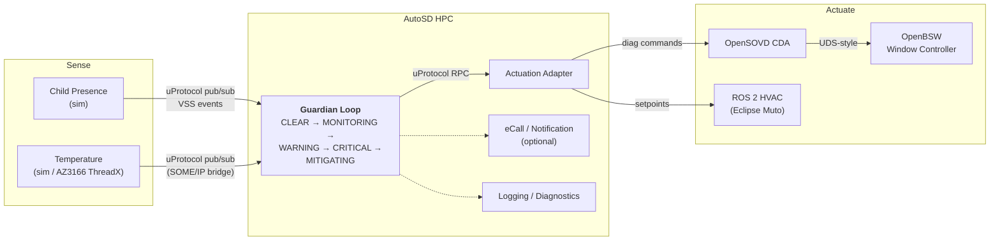

<div align="center">

# Bare-Metal-Mafia

### Guardian Loop — portable child presence detection

**One feature. One codebase. Simulation, AutoSD, real hardware.**

*Eclipse SDV Hackathon 2026 · [Hack to the Future](https://github.com/Eclipse-SDV-Hackathon-Chapter-Four/Hack-to-the-Future) challenge*

**Stage 1** done · **Stage 2** done · **Stage 3** open · **Stage 4** partial · **Stage 5** open

</div>

---

## Goal

Build a **Child Presence Detection and Mitigation** feature that:

1. detects that a child is in the car,
2. monitors cabin temperature,
3. determines a hazard level,
4. warns and intervenes (HVAC, windows, alarm, eCall),

and keeps working unchanged while the world underneath it is swapped from
simulators to embedded targets to real hardware.

> ### The Golden Rule
>
> **The Guardian Loop business logic must not change between simulation and real hardware.**
>
> The Guardian therefore never addresses any of the following directly:
>
> | Forbidden inside Guardian | Use instead |
> |---|---|
> | CAN, GPIO, serial ports | uProtocol pub/sub on VSS topics |
> | UDS, DoIP, ECU DIDs | uProtocol RPC to the Actuation Adapter, then CDA |
> | SOME/IP | a SOME/IP to uProtocol bridge service |
> | Hardware addresses, device paths | service URIs only |
>
> If swapping a sensor or an actuator forces a change to `guardian.rs`, the design is wrong.

---

## Architecture



**Transport:** every uProtocol message passes through an Eclipse Zenoh router.
No service knows where any other service runs, and that is what makes the swap possible.

### Communication patterns

| Pattern | Use it for | Example |
|---|---|---|
| **uProtocol pub/sub** | sensor data and state broadcasts: fire and forget, many listeners | temperature event, child-presence event, Guardian state |
| **uProtocol RPC** | one service asking another to perform an operation and awaiting the result | Guardian to Actuation Adapter: HVAC on, 18 °C, fan 100 %, close window |

---

#### Early Warning System (EWS) API

Request Guardian State:

```Rust
struct EwsGuardianState {
    time: u64,

    temperature: f32,
    child_presence: bool,

    hvac_active: bool,
    windows_down: bool,
    state: GuardianState,
};

enum GuardianState {
    Clear,
    Monitoring,
    Warning,
    Critical,
    Mitigating,
}
```

Warn Guardian:

```Rust
struct EWSWarn {
    time: u64,
    reason: Reason,
}

enum Reason {
    Heat = 0,
}
```

The Guardian exposes this API as a WebSocket at `ws://localhost:8765/ws`.
It sends a JSON `GuardianState` update every second. The `time` value is Unix
time in milliseconds, and `state` is the Guardian's current state enum. EWS
warnings are received as JSON `EWSWarn` messages on the same connection.

#### Notification service

*(Contents of this header was created by Claude Opus 5.5)*

`notification/` is a dependency-free Java service that connects to the EWS WebSocket
and sends a Telegram message on every Guardian state change. It reconnects if the
Guardian restarts.

1. Create a bot with [@BotFather](https://t.me/BotFather) and copy the token.
2. Send the bot a message, then read your chat id from
   `https://api.telegram.org/bot<token>/getUpdates` (`message.chat.id`).
3. Put both into `.env` (git-ignored) or export them:

   ```bash
   TELEGRAM_BOT_TOKEN=123456:ABC...
   TELEGRAM_CHAT_ID=987654321
   ```

4. `docker compose up --build` starts the service next to the Guardian.

If either variable is unset, the service runs in dry-run mode and only logs the messages
(`docker compose logs -f notification`). To run it outside Docker:

```bash
javac -d notification/out notification/src/*.java
GUARDIAN_EWS_URL=ws://localhost:8765/ws java -cp notification/out NotificationService
```

## Development Journey

The official challenge progression, and where we stand:

| Stage | Objective | Status | Notes |
|:--:|---|---|---|
| **1** | **Guardian Loop on your laptop.** Simulated sensors publish over uProtocol, Guardian shows state transitions | **Done** | Inherited from the reference stack. `docker compose up` shows the full escalation in about 30 s |
| **2** | **Add simulated actuation.** uProtocol RPC to Actuation Adapter, CDA, window controller | **Done** | The SIL loop is closed end to end. The ROS 2 HVAC path is wired up as well |
| **3** | **Run Guardian on AutoSD.** Same artifact, only deployment and configuration change | **Open** | `deploy/` is still empty. This is our largest gap |
| **4** | **Replace the temperature simulator.** AZ3166 with Eclipse ThreadX over SOME/IP | **Partial** | Firmware, Renode emulation and the SOME/IP bridge exist. The physical board does not |
| **5** | **Replace the simulated actuator.** openDuT switches to OpenBSW or physical targets | **Open** | Not started. Requires an openDuT testbench topology |

---

## Our Goals

Ordered by what unblocks the most. Each goal names the stage it serves.

| # | Goal | Serves | Rationale |
|:--:|---|:--:|---|
| 1 | **Get openDuT running as our testbench** | Stage 5 | Prerequisite for any hardware-swap demo. It must switch between at least two topologies, fully simulated and with a real endpoint |
| 2 | **Deploy Guardian on the AutoSD HPC** | Stage 3 | Full-challenge requirement and currently untouched. The proof point is an identical service artifact before and after |
| 3 | **Move the sensors to real hardware** | Stage 4 | AZ3166 with ThreadX replaces `temperature-sim`, and Guardian must not notice |
| 4 | **Strengthen the Guardian decision logic** | bonus | Our differentiator beyond the Definition of Done. See below |
| 5 | **Leverage the ROS 2 and Muto HVAC path** | Stage 2+ | Already present in `ros2-hvac/`. The work is integration and demonstration, not implementation |
| 6 | **Build the demo narrative along the five stages** | all | Showing the same `evaluate_state` survive every swap is the pitch |

### Guardian logic ideas (goal 4)

- **Rate of change.** A cabin heating at 0.5 °C/s is an emergency long before it crosses 40 °C.
- **Sensor confidence.** The child-presence event already carries a confidence field, 0.98 in the simulator, and we currently ignore it. Use it to gate escalation.
- **Redundant sensors.** Fuse several temperature sources and degrade gracefully when one drops out.
- **Fault tolerance.** The stack already demonstrates an HVAC fault forcing escalation to window and alarm. Generalise that behaviour.

> All of this stays inside `evaluate_state` in `services/src/lib.rs`, and none of it may
> introduce a transport or hardware dependency. See the Golden Rule.

---

## Building Blocks

| Block | Location | Status |
|---|---|---|
| **Guardian Loop**, hazard state machine | `services/src/bin/guardian.rs`, logic in `services/src/lib.rs` | Done |
| **Child Presence Sensor**, simulated | `services/src/bin/child_presence_sim.rs` | Done, simulated |
| **Temperature Sensor**, simulated with closed-loop thermal model | `services/src/bin/temperature_sim.rs` | Done, simulated |
| **Temperature Sensor**, ThreadX firmware | `threadx-temp-sensor/` (Renode) | Partial, emulated |
| **Temperature Sensor**, AZ3166 hardware | — | Open, board missing |
| **SOME/IP to uProtocol bridges** | `someip_uprot_bridge.rs`, `someip_window_bridge.rs` | Done |
| **Actuation Adapter**, uProtocol RPC to diagnostics | `services/src/bin/actuation_adapter.rs` | Done |
| **OpenSOVD CDA**, diagnostic bridge | `services/src/bin/cda_sim.rs` | Done, simulated |
| **OpenBSW Window Controller** | `services/src/bin/window_controller_sim.rs` | Done, simulated |
| **ROS 2 HVAC workload**, Eclipse Muto with CAN bridge | `ros2-hvac/`, `services/src/bin/ros2_hvac_bridge.rs` | Done |
| **Dashboard**, live one-page view | `services/src/bin/dashboard.rs`, port 8094 | Done |
| **AutoSD HPC deployment** | `deploy/` | Open |
| **openDuT topology** | — | Open |
| **eCall / Notification service**, Telegram via EWS WebSocket (Java) | `notification/` | Done, mock |

> Nothing here is written from scratch. The challenge is integration and portability
> rather than reimplementation; the end-to-end SDV architecture is the point.

---

## Quick Start

```bash
docker compose up --build          # full SIL stack
```

Then open the dashboard at <http://localhost:8094>.

The simulators run a scripted scenario at start-up, so every Guardian state appears
within roughly 30 seconds:

| Time | Event | Guardian state |
|:--:|---|---|
| ~1 s | 26 °C, no child | `CLEAR` |
| ~5 s | child present, confidence 0.98, zone `rear_center` | `MONITORING` |
| ~5 s | 36 °C | `WARNING` |
| ~9 s | 43 °C | `CRITICAL`, then `MITIGATING`: HVAC on, 18 °C, fan 100 % |
| +12 s | HVAC never confirms | `MITIGATING` stage 2: window 25 %, alarm |

Optional profiles:

```bash
docker compose --profile ros2 up --build      # adds ROS 2 HVAC via Eclipse Muto
docker compose --profile threadx up --build   # adds the ThreadX sensor over SOME/IP
```

The full walkthrough is in [docs/Tutorial.md](docs/Tutorial.md).

---

## Documentation

| Document | Read it when |
|---|---|
| [docs/Tutorial.md](docs/Tutorial.md) | You want the stack running and explained service by service |
| [docs/Guardian-loop.md](docs/Guardian-loop.md) | You are building a component and need to know which existing project to copy from |
| [docs/structure.drawio](docs/structure.drawio) | You need the editable architecture diagram |

---

## Open Dependencies

- **More AZ3166 boards.** Blocks Stage 4 on real hardware.
- **openDuT testbench access.** Blocks Stage 5.
- Renode keeps the ThreadX path moving while boards are unavailable.

---

## Definition of Done

**Core challenge**

- [x] Sensor data reaches the Guardian
- [x] Communication exclusively via service interfaces
- [x] Guardian evaluates risk and exposes its state on `:8080/state`
- [x] Guardian can trigger a mitigation action
- [x] Simulated ECU and actuator integration
- [x] uProtocol pub/sub implemented
- [x] uProtocol RPC implemented
- [x] Guardian operates transport-independently
- [ ] An endpoint is replaced without touching the business logic, and we demonstrate it

**Full challenge**

- [ ] Guardian running on AutoSD
- [ ] openDuT manages the topology change
- [ ] At least one physical embedded endpoint (AZ3166 with ThreadX)
- [ ] Identical service artifacts before and after the configuration change

## Pi credentials

- Hostname: pi
- Username: pi
- Password: pi

Connect via ssh: `ssh pi@pi`
