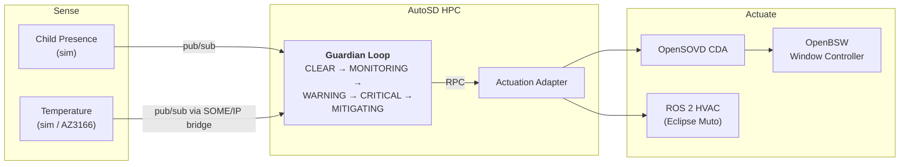

<div align="center">

# Bare-Metal-Mafia

### Guardian Loop — portable child presence detection

*Eclipse SDV Hackathon 2026 · [Hack to the Future](https://github.com/Eclipse-SDV-Hackathon-Chapter-Four/Hack-to-the-Future) challenge*

</div>

---

## Goal

Build a **Child Presence Detection and Mitigation** feature that:

- detects a child in the car,
- monitors the cabin temperature,
- decides how dangerous the situation is,
- warns and acts (air conditioning, windows, alarm).

The feature must keep working unchanged while the hardware underneath it is swapped.

> ### The one rule
>
> **The Guardian Loop logic must not change between simulation and real hardware.**
>
> The Guardian therefore never talks directly to:
> CAN, GPIO, serial ports, UDS, DoIP, SOME/IP, device paths or hardware addresses.
> It only uses uProtocol service interfaces.
>
> If swapping a sensor forces a change in `guardian.rs`, the design is wrong.

### Our current goal

**Get the temperature sensor onto real hardware, with the Guardian Loop still running on a laptop.**

- This is Configuration B in [docs/Guardian-loop.md](docs/Guardian-loop.md): real sensor, simulated window.
- **openDuT is not needed for this.** It is only planned later, to *switch* between the simulated and the real sensor.
- other team members will put the window actuator and OpenBSW on a S32K

---

## Task Distribution

| # | Member | Task | Note |
| :--: | --- | --- | --- |
| 1 | Elias | Overview, ROS2 > Gazebo Sim | Git, backlog |
| 2 | Lars | Overview, management | Git, (openDuT not used), AutoSD |
| 3 | Terra | openDuT, OpenBSW | Working hardware |
| 4 | Dimitri | openDuT, OpenBSW | Working hardware |
| 5 | Katharina | Loop features | Software architecture > Guardian loop API |

---

## Architecture



---

## Where We Stand

| Stage | Objective | Status |
| :--: | --- | --- |
| **1** | Guardian Loop on the laptop, simulated sensors | **Done** |
| **2** | Simulated actuation: Actuation Adapter, CDA, window controller | **Done** |
| **3** | Guardian on AutoSD | **Open**, `deploy/` is empty |
| **4** | Real temperature sensor on the AZ3166 | **Open** |
| **5** | Real actuator, openDuT switches topologies | **Open** |

Still missing for the full challenge:

- [x] Guardian running on AutoSD
- [ ] openDuT manages the topology change
- [x] One physical endpoint (AZ3166)
- [x] Identical service artifacts before and after the swap

---

## Quick Start

```bash
docker compose up --build                     # full software stack
docker compose --profile threadx up --build   # with the SOME/IP sensor path
docker compose --profile ros2 up --build      # with the ROS 2 air conditioning
```

Dashboard: <http://localhost:8094>

---

## Guardian Logic Ideas

Improvements that stay inside `evaluate_state` and add no hardware dependency:

- **Rate of change.** A cabin heating at 0.5 °C per second is an emergency long before it reaches 40 °C.
- **Sensor confidence.** The child-presence event already carries a confidence value, 0.98 in the simulator, and we ignore it. Use it to gate escalation.
- **Redundant sensors.** Combine several temperature sources and keep working when one drops out.
- **Fault tolerance.** The stack already shows an air conditioning fault forcing escalation to window and alarm. Generalise that.

---

## Documentation

| Document | Read it when |
| --- | --- |
| [docs/Tutorial.md](docs/Tutorial.md) | You want the stack running and explained |
| [docs/Guardian-loop.md](docs/Guardian-loop.md) | You need to know which existing project to copy from |
| [docs/structure.drawio](docs/structure.drawio) | You need the editable architecture diagram |
