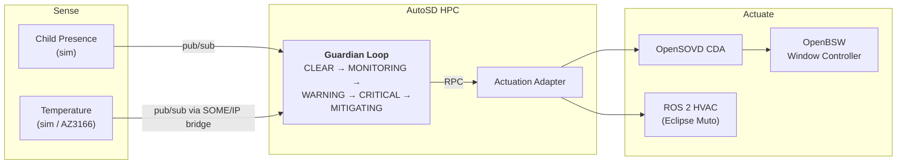

<div align="center">

# Bare-Metal-Mafia

### Guardian Loop — portable child presence detection

*Eclipse SDV Hackathon 2026 · [Hack to the Future](https://github.com/Eclipse-SDV-Hackathon-Chapter-Four/Hack-to-the-Future) challenge*

</div>

---

## Goal

Build a **Child Presence Detection and Mitigation** feature that:

- detects a child in the car,
- monitors the cabin temperature,
- decides how dangerous the situation is,
- warns and acts (air conditioning, windows, alarm).

The feature must keep working unchanged while the hardware underneath it is swapped.

> ### The one rule
>
> **The Guardian Loop logic must not change between simulation and real hardware.**
>
> The Guardian therefore never talks directly to:
> CAN, GPIO, serial ports, UDS, DoIP, SOME/IP, device paths or hardware addresses.
> It only uses uProtocol service interfaces.
>
> If swapping a sensor forces a change in `guardian.rs`, the design is wrong.

### Our current goal

**Get the temperature sensor onto real hardware, with the Guardian Loop still running on a laptop.**

- This is Configuration B in [docs/Guardian-loop.md](docs/Guardian-loop.md): real sensor, simulated window.
- **openDuT is not needed for this.** It is only needed later, to *switch* between the simulated and the real sensor.
- The window actuator and OpenBSW stay simulated for now.

---

## Task Distribution

| # | Member | Task | Note |
| :--: | --- | --- | --- |
| 1 | Elias | Overview | Git, backlog |
| 2 | Lars | Overview | openDuT, AutoSD |
| 3 | Terra | openDuT, OpenBSW | Working hardware |
| 4 | Dimitri | openDuT, OpenBSW | Working hardware |
| 5 | Katharina | Loop features | Software architecture |

**When someone is free:** get the temperature sensor running on the AZ3166 board
(HTS221 for temperature and humidity, or LPS22HB for temperature and pressure).

> The sensor firmware is the critical path for our current goal.
> At least one person from the hardware pair should move over to it.

---

## Next Steps

In this order. Each step only makes sense if the one before it works.

1. **Prove the existing path.** Run `docker compose --profile threadx up --build`, then stop `temperature-sim` so two sources do not fight over the Guardian. This is the known-good baseline.
2. **Send the packet by hand.** A short Python script that sends the 28-byte packet to UDP port 30501. Proves the bridge, the port and the firewall without any firmware involved.
3. **Flash the board.** Start from the [AZ3166 ThreadX example](https://github.com/chheis/challenge-threadx-playRemote/blob/4f9cac54efcd383f1cadcedb4aa3c93a97ba9dd0/MXChip/AZ3166/app/main.c#L770), read the sensor, send the same packet to the laptop. Do **not** build a board support package inside `threadx-temp-sensor/`.
4. **Make the thresholds configurable.** See Known Problems.
5. **Add openDuT** to switch between the simulator and the board. Only now does it have something to switch.

### The packet format

Sent by UDP to the bridge on port 30501. Defined in `services/src/bin/someip_uprot_bridge.rs`.

| Bytes | Content |
| --- | --- |
| 0–1 | Service identifier `0x1234` |
| 2–3 | Event identifier `0x8001` |
| 4–7 | Length `0x00000014` |
| 8–9 | Client identifier `0x0001` |
| 10–11 | Session counter, increments |
| 12–13 | Protocol and interface version, both `0x01` |
| 14 | Message type `0x02` (notification) |
| 15 | Return code `0x00` |
| 16–19 | Temperature in °C, 32-bit float, big-endian |
| 20–27 | Timestamp in milliseconds, 64-bit, big-endian |

---

## What We Need

- **One MXChip AZ3166 board.** One is enough for the current goal, so do not wait for more.
- **A micro-USB data cable.** Charge-only cables waste hours.
- **A 2.4 GHz Wi-Fi network** the laptop is also on. The board cannot do 5 GHz. A phone hotspot avoids company network restrictions.
- **Something to heat the sensor** for the demo: a hair dryer, a hand, a warm mug.
- **An ST-LINK probe**, only if we need to step through the firmware. Flashing works over USB.

---

## Known Problems

- **The ThreadX sensor does not measure anything.** `threadx-temp-sensor/` computes the temperature from a formula. Treat it as the definition of the message format, not as firmware.
- **The firmware cannot be flashed today.** No linker script, no startup code, no board support package. The build targets an STM32F407, the AZ3166 is an STM32F412.
- **The board has no Ethernet.** The Renode emulation pretends it has one. The real board needs Wi-Fi, so the emulation is not a rehearsal for the hardware.
- **The board cannot resolve `someip-uprot-bridge`.** That is a Docker name. The firmware needs the laptop's numeric IP address.
- **The Windows firewall drops incoming UDP silently.** Open port 30501 before debugging firmware.
- **A real sensor never reaches 43 °C.** The thresholds are hardcoded in `services/src/lib.rs:281`. Editing them by hand breaks our own rule. Make them environment variables with the current values as defaults, which is a configuration change rather than a logic change.

---

## Architecture



- Every message goes through an Eclipse Zenoh router. No service knows where another one runs.
- **Publish and subscribe** for sensor data and state broadcasts.
- **Remote procedure call** when the Guardian asks another service to do something and wants an answer.

---

## Where We Stand

| Stage | Objective | Status |
| :--: | --- | --- |
| **1** | Guardian Loop on the laptop, simulated sensors | **Done** |
| **2** | Simulated actuation: Actuation Adapter, CDA, window controller | **Done** |
| **3** | Guardian on AutoSD | **Open**, `deploy/` is empty |
| **4** | Real temperature sensor on the AZ3166 | **In progress**, our current goal |
| **5** | Real actuator, openDuT switches topologies | **Open** |

Still missing for the full challenge:

- [ ] Guardian running on AutoSD
- [ ] openDuT manages the topology change
- [ ] One physical endpoint (AZ3166)
- [ ] Identical service artifacts before and after the swap

---

## Quick Start

```bash
docker compose up --build                     # full software stack
docker compose --profile threadx up --build   # with the SOME/IP sensor path
docker compose --profile ros2 up --build      # with the ROS 2 air conditioning
```

Dashboard: <http://localhost:8094>

The simulators run a fixed scenario at start-up, so every Guardian state appears within
about 30 seconds: `CLEAR` → `MONITORING` → `WARNING` → `CRITICAL` → `MITIGATING`.

---

## Guardian Logic Ideas

Improvements that stay inside `evaluate_state` and add no hardware dependency:

- **Rate of change.** A cabin heating at 0.5 °C per second is an emergency long before it reaches 40 °C.
- **Sensor confidence.** The child-presence event already carries a confidence value, 0.98 in the simulator, and we ignore it. Use it to gate escalation.
- **Redundant sensors.** Combine several temperature sources and keep working when one drops out.
- **Fault tolerance.** The stack already shows an air conditioning fault forcing escalation to window and alarm. Generalise that.

---

## Documentation

| Document | Read it when |
| --- | --- |
| [docs/Tutorial.md](docs/Tutorial.md) | You want the stack running and explained |
| [docs/Guardian-loop.md](docs/Guardian-loop.md) | You need to know which existing project to copy from |
| [docs/structure.drawio](docs/structure.drawio) | You need the editable architecture diagram |
