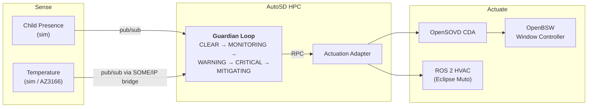

<div align="center">

# Bare-Metal-Mafia

### Guardian Loop — portable child presence detection

*Eclipse SDV Hackathon 2026 · [Hack to the Future](https://github.com/Eclipse-SDV-Hackathon-Chapter-Four/Hack-to-the-Future) challenge*

**Stage 1** done · **Stage 2** done · **Stage 3** partial · **Stage 4** done · **Stage 5** partial

[What we achieved, and what we did not](docs/Achieved.md)

</div>

---

## Goal

Build a **Child Presence Detection and Mitigation** feature that:

- detects a child in the car,
- monitors the cabin temperature,
- decides how dangerous the situation is,
- warns and acts (air conditioning, windows, alarm).

The feature must keep working unchanged while the hardware underneath it is swapped.

> ### The one rule
>
> **The Guardian Loop logic must not change between simulation and real hardware.**
>
> The Guardian therefore never talks directly to:
> CAN, GPIO, serial ports, UDS, DoIP, SOME/IP, device paths or hardware addresses.
> It only uses uProtocol service interfaces.
>
> | Forbidden inside Guardian | Use instead |
> | --- | --- |
> | CAN, GPIO, serial ports | uProtocol pub/sub on VSS topics |
> | UDS, DoIP, ECU DIDs | uProtocol RPC to the Actuation Adapter, then CDA |
> | SOME/IP | a SOME/IP to uProtocol bridge service |
> | Hardware addresses, device paths | service URIs only |
>
> If swapping a sensor or an actuator forces a change to `guardian.rs`, the design is wrong.

---

## Task Distribution

| # | Member | Task | Note |
| :--: | --- | --- | --- |
| 1 | Elias | Overview, ROS 2 > Gazebo simulation | Git, backlog |
| 2 | Lars | Overview, management | Git, AutoSD (openDuT not used) |
| 3 | Terra | openDuT, OpenBSW | Working hardware |
| 4 | Dimitri | openDuT, OpenBSW | Working hardware |
| 5 | Katharina | Loop features | Software architecture > Guardian loop API |

---

## Architecture



**Transport:** every uProtocol message passes through an Eclipse Zenoh router.
No service knows where any other service runs, and that is what makes the swap possible.

### Communication patterns

| Pattern | Use it for | Example |
| --- | --- | --- |
| **uProtocol pub/sub** | sensor data and state broadcasts: fire and forget, many listeners | temperature event, child-presence event, Guardian state |
| **uProtocol RPC** | one service asking another to perform an operation and awaiting the result | Guardian to Actuation Adapter: HVAC on, 18 °C, fan 100 %, close window |

---

#### Early Warning System (EWS) API

Request Guardian State:

```Rust
struct EwsGuardianState {
    time: u64,

    temperature: f32,
    child_presence: bool,
    state: GuardianState,

    hvac_active: bool,
    hvac_target: f32,
    hvac_fault: bool,
};

enum GuardianState {
    Clear,
    Monitoring,
    Warning,
    Critical,
    Mitigating,
}
```

Warn Guardian:

```Rust
struct EWSWarn {
    time: u64,
    reason: Reason,
}

enum Reason {
    Reset,
    Heat,
}
```

The Guardian exposes this API as a WebSocket at `ws://localhost:8765/ws`.
It sends a JSON `GuardianState` update every second. The `time` value is Unix
time in milliseconds, and `state` is the Guardian's current state enum. EWS
warnings are received as JSON `EWSWarn` messages on the same connection.

#### Notification service

*(Contents of this header was created by Claude Opus 5.5)*

`notification/` is a dependency-free Java service that connects to the EWS WebSocket
and sends a Telegram message on every Guardian state change. It reconnects if the
Guardian restarts.

1. Create a bot with [@BotFather](https://t.me/BotFather) and copy the token.
2. Send the bot a message, then read your chat id from
   `https://api.telegram.org/bot<token>/getUpdates` (`message.chat.id`).
3. Put both into `.env` (git-ignored) or export them:

   ```bash
   TELEGRAM_BOT_TOKEN=123456:ABC...
   TELEGRAM_CHAT_ID=987654321
   ```

4. `docker compose up --build` starts the service next to the Guardian.

If either variable is unset, the service runs in dry-run mode and only logs the messages
(`docker compose logs -f notification`). To run it outside Docker:

```bash
javac -d notification/out notification/src/*.java
GUARDIAN_EWS_URL=ws://localhost:8765/ws java -cp notification/out NotificationService
```

## Development Journey

The official challenge progression, and where we stand:

| Stage | Objective | Status | Notes |
| :--: | --- | --- | --- |
| **1** | **Guardian Loop on your laptop.** Simulated sensors publish over uProtocol, Guardian shows state transitions | **Done** | Inherited from the reference stack. `docker compose up` shows the full escalation in about 30 s |
| **2** | **Add simulated actuation.** uProtocol RPC to Actuation Adapter, CDA, window controller | **Done** | The SIL loop is closed end to end. The ROS 2 HVAC path is wired up as well |
| **3** | **Run Guardian on AutoSD.** Same artifact, only deployment and configuration change | **Partial** | Guardian and zenohd run as real Podman containers inside AutoSD on a Raspberry Pi. The rest of the stack was never built in the VM. See [deploy/AUTOSD_ON_PI.md](deploy/AUTOSD_ON_PI.md) |
| **4** | **Replace the temperature simulator.** AZ3166 with Eclipse ThreadX over SOME/IP | **Done** | Runs on the physical board over USB serial, plus the Renode and SOME/IP paths |
| **5** | **Replace the simulated actuator.** openDuT switches to OpenBSW or physical targets | **Partial** | The S32K148 with OpenBSW is driven over real DoIP/UDS. openDuT itself was never started |

---

## Our Goals

What we set out to do, ordered by what unblocks the most, with how it ended.
The full recap is in [docs/Achieved.md](docs/Achieved.md).

| # | Goal | Serves | Outcome |
| :--: | --- | :--: | --- |
| 1 | **Get openDuT running as our testbench** | Stage 5 | **Not started.** The one requirement we never reached |
| 2 | **Deploy Guardian on the AutoSD HPC** | Stage 3 | **Partial.** Guardian and zenohd run as Podman containers in the AutoSD VM on the Pi |
| 3 | **Move the sensors to real hardware** | Stage 4 | **Done.** AZ3166 with ThreadX replaced `temperature-sim`, and the Guardian never noticed |
| 4 | **Strengthen the Guardian decision logic** | bonus | **Partial.** Redundant sensors and fault tolerance landed, rate of change and confidence did not. See below |
| 5 | **Leverage the ROS 2 and Muto HVAC path** | Stage 2+ | **Done.** Plus our own Gazebo cabin and the generic ROS 2 ↔ uProtocol bridge |
| 6 | **Build the demo narrative along the five stages** | all | **Done.** `ros-up-bridge/demo-guardian.sh` runs it end to end |

### Guardian logic ideas (goal 4)

- **Redundant sensors.** *Done.* `CabinTemperatureEvent` carries a `sensor_id`, a second temperature sensor was added, and two sensors disagreeing by more than 5 °C mark each other broken.
- **Fault tolerance.** *Done.* If every known sensor is broken the Guardian starts cooling anyway — a missing sensor is not a safe cabin.
- **Rate of change.** *Open.* A cabin heating at 0.5 °C/s is an emergency long before it crosses 40 °C.
- **Sensor confidence.** *Open.* The child-presence event already carries a confidence field, 0.98 in the simulator, and we still ignore it. Use it to gate escalation.

> All of this stays inside `evaluate_state` in `services/src/lib.rs`, and none of it may
> introduce a transport or hardware dependency. See the Golden Rule.

---

## Building Blocks

| Block | Location | Status |
| --- | --- | --- |
| **Guardian Loop**, hazard state machine | `services/src/bin/guardian.rs`, logic in `services/src/lib.rs` | Done |
| **Child Presence Sensor**, simulated | `services/src/bin/child_presence_sim.rs` | Done, simulated |
| **Temperature Sensor**, simulated with closed-loop thermal model | `services/src/bin/temperature_sim.rs` | Done, simulated |
| **Temperature Sensor**, ThreadX firmware | `threadx-temp-sensor/` (Renode) | Partial, emulated |
| **Temperature Sensor**, AZ3166 hardware | `az3166-sensor-bridge-firmware/`, `services/src/bin/az3166_serial_bridge.rs` | Done, **on real hardware** (LSM6DSL die temperature + HTS221 humidity over USB serial) |
| **SOME/IP to uProtocol bridges** | `someip_uprot_bridge.rs`, `someip_window_bridge.rs` | Done |
| **Actuation Adapter**, uProtocol RPC to diagnostics | `services/src/bin/actuation_adapter.rs` | Done |
| **OpenSOVD CDA**, diagnostic bridge | `services/src/bin/cda_sim.rs` | Done, simulated |
| **OpenBSW Window Controller**, simulated | `services/src/bin/window_controller_sim.rs` | Done, simulated |
| **OpenBSW Window Controller**, S32K148 hardware | `firmware/`, `services/src/bin/s32k148_doip_bridge.rs` | Done, **on real hardware** (UDS `0x2E` over DoIP, DID `0xCF20`) |
| **ROS 2 HVAC workload**, Eclipse Muto with CAN bridge | `ros2-hvac/`, `services/src/bin/ros2_hvac_bridge.rs` | Done |
| **Dashboard**, live one-page view | `services/src/bin/dashboard.rs`, port 8094 | Done |
| **Gazebo cabin simulation**, Fortress world (window joint, seat contact) and `ros_gz_bridge`, profile `gazebo`, laptops only | `gazebo-sim/` | Done, **our own work** (not from the reference stack) |
| **Generic ROS 2 ↔ uProtocol bridge** (`ros-up-bridge`), YAML-mapped; mode *mirror* (Gazebo follows the window state) and *replace* (Gazebo replaces the window controller and child presence simulators) | `ros-up-bridge/`, `services/src/bin/ros_up_mapper/` | Done, **our own work** (not from the reference stack) |
| **AutoSD HPC deployment** | `deploy/AUTOSD_ON_PI.md`, `deploy/setup-raspi-guardian-node.sh` | Partial, Guardian + zenohd proven in the VM |
| **openDuT topology** | — | Open, never started |
| **eCall / Notification service**, Telegram via EWS WebSocket (Java) | `notification/` | Done, mock |

> Nothing here is written from scratch. The challenge is integration and portability
> rather than reimplementation; the end-to-end SDV architecture is the point.

---

## Quick Start

```bash
docker compose up --build          # full SIL stack
```

Then open the dashboard at <http://localhost:8094>.

The simulators run a scripted scenario at start-up, so every Guardian state appears
within roughly 30 seconds:

| Time | Event | Guardian state |
| :--: | --- | --- |
| ~1 s | 26 °C, no child | `CLEAR` |
| ~5 s | child present, confidence 0.98, zone `rear_center` | `MONITORING` |
| ~5 s | 36 °C | `WARNING` |
| ~9 s | 43 °C | `CRITICAL`, then `MITIGATING`: HVAC on, 18 °C, fan 100 % |
| +12 s | HVAC never confirms | `MITIGATING` stage 2: window 25 %, alarm |

Optional profiles:

```bash
docker compose --profile ros2 up --build      # adds ROS 2 HVAC via Eclipse Muto
docker compose --profile threadx up --build   # adds the ThreadX sensor over SOME/IP
docker compose --profile gazebo up --build    # adds the Gazebo cabin simulation (see gazebo-sim/README.md)
COMPOSE_CMD="docker compose" HVAC=1 ./ros-up-bridge/demo-guardian.sh   # Guardian Loop with Gazebo + HVAC, live status lines
```

The full walkthrough is in [docs/Tutorial.md](docs/Tutorial.md).

---

## Documentation

| Document | Read it when |
| --- | --- |
| [docs/Achieved.md](docs/Achieved.md) | You want the honest recap: what we built, what we did not, and why |
| [docs/Tutorial.md](docs/Tutorial.md) | You want the stack running and explained service by service |
| [docs/Guardian-loop.md](docs/Guardian-loop.md) | You are building a component and need to know which existing project to copy from |
| [deploy/AUTOSD_ON_PI.md](deploy/AUTOSD_ON_PI.md) | You want the Guardian running on AutoSD, and the three blockers we hit |
| [firmware/S32K148_HARDWARE_BRINGUP.md](firmware/S32K148_HARDWARE_BRINGUP.md) | You are bringing up the S32K148 and the automotive Ethernet link |
| [docs/structure.drawio](docs/structure.drawio) | You need the editable architecture diagram |

---

## Open Dependencies

- **openDuT testbench access.** Blocks the topology-change half of Stage 5.
- **More AZ3166 boards.** One board carries the temperature path today; a second
  would give the Guardian two real sensors to disagree about.
- Renode still keeps the ThreadX path runnable without a board.

---

## Definition of Done

**Core challenge**

- [x] Sensor data reaches the Guardian
- [x] Communication exclusively via service interfaces
- [x] Guardian evaluates risk and exposes its state on `:8080/state`
- [x] Guardian can trigger a mitigation action
- [x] Simulated ECU and actuator integration
- [x] uProtocol pub/sub implemented
- [x] uProtocol RPC implemented
- [x] Guardian operates transport-independently
- [x] An endpoint is replaced without touching the business logic, and we demonstrate it

**Full challenge**

- [x] Guardian running on AutoSD — as a real Podman container in the AutoSD VM on a Raspberry Pi. Guardian and zenohd only; the rest of the stack was never built inside the VM
- [ ] openDuT manages the topology change — never started, our one untouched requirement
- [x] At least one physical embedded endpoint (AZ3166 with ThreadX) — and a second one, the S32K148 with OpenBSW over DoIP/UDS
- [x] Identical service artifacts before and after the configuration change

## AI Usage

We follow the Eclipse Foundation's
[Generative Artificial Intelligence Usage Guidelines for Eclipse Committers](https://www.eclipse.org/projects/guidelines/genai)
(version 1.0, April 2024). In short, the guidelines ask us to be transparent
about the generative AI platforms we used, to verify the accuracy of
generated output through our normal vetting (testing, intellectual property
due diligence, security), and to respect intellectual property and the
platform's terms of use. They suggest disclosing AI use in a comment just
below the copyright and licence header.

**Tools used**

| Tool | Used for |
|---|---|
| Claude Code with Anthropic Claude Opus 5.5 (`claude-opus-5-5`) | `gazebo-sim/` (Gazebo simulation backend) and most of `ros-up-bridge/` + `services/src/bin/ros_up_mapper/` (ROS 2 ↔ uProtocol bridge): code, configuration, tests and their documentation, plus the related additions to `docker-compose.yml` (the `gazebo-sim` service), to this README and [NOTICE.md](NOTICE.md) |
| Claude Code with Anthropic Claude Fable 5.1 (`claude-fable-5-1`) | the bridge's replace mode (state/presence routes, runtime single-publisher guard, `compose.replace.yml`, `test-replace.sh`), later parts of mirror (setpoint repeat, test hardening), the separate Gazebo server/GUI start, and the publish-race fix in `services/src/bin/window_controller_sim.rs` (marked with `Assisted-by` comments in that file) |

**How we mark it.** These are our project conventions on top of the
guidelines, not requirements of the guidelines themselves:

- Files that are largely AI-generated carry a header with the Apache-2.0
  copyright notice, an *AI Disclosure* paragraph stating that the
  AI-generated portions are made available under CC0-1.0, the SPDX
  identifier `Apache-2.0 AND CC0-1.0`, and an `Assisted-by:` line naming the
  model. See also [NOTICE.md](NOTICE.md).
- Commits that used AI assistance carry an `Assisted-by:` trailer, e.g.
  `Assisted-by: Anthropic Claude Opus 5.5 (claude-opus-5-5)`.
- Files we edited only partly with AI assistance (for example this README or
  `docker-compose.yml`, which come from the reference stack or from team
  members) keep their existing headers; the AI-assisted changes are
  identifiable through the commit trailers.

**Review.** All contributions, AI-assisted or not, are reviewed by a human
team member before they are merged, and AI-generated code is tested like any
other code.

**Older commits.** Commits that were pushed before we adopted these
conventions may have been created with AI assistance but do not carry an
`Assisted-by:` trailer. We do not rewrite published history to add it.

**AI-generated files without a header.** Files without a comment syntax
(for example JSON) cannot carry the header and are listed here instead:
currently none.

## Pi credentials

- Hostname: pi
- Username: pi
- Password: pi

Connect via ssh: `ssh pi@pi`
