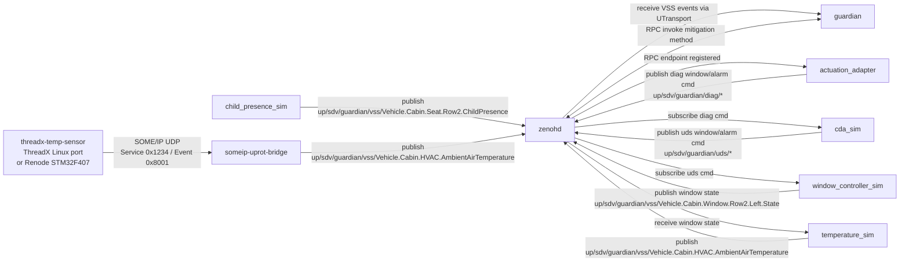
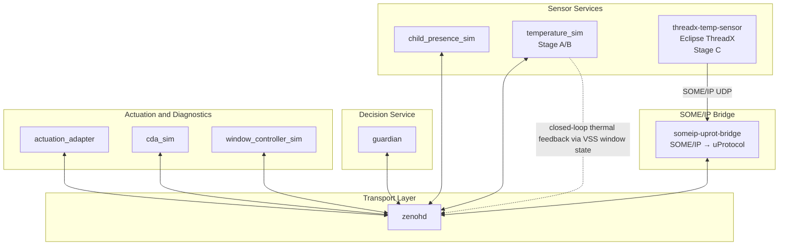

# Tutorial
# hack-to-the-future

Minimal Rust-based demo for a child-in-car guardian flow using uProtocol over Zenoh.

## What is in this repo

- `guardian`: central decision service.
- `child_presence_sim`: publishes child presence events.
- `temperature_sim`: software temperature simulator for the closed loop. It exists, but is currently commented out in [`docker-compose.yml`]
- `actuation_adapter`: receives mitigation requests from `guardian`.
- `cda_sim`: simulated diagnostics layer.
- `window_controller_sim`: simulated window actuator.
- `someip_uprot_bridge`: converts SOME/IP temperature messages to uProtocol.
- `someip_window_bridge`: converts window-state uProtocol events back to SOME/IP.
- `threadx-temp-sensor/`: Eclipse ThreadX temperature sensor used for the ThreadX/SOME-IP path.

## Prerequisites

- Rust and Cargo
- Docker with Docker Compose

## Quick start

Check that the workspace builds:

```bash
cargo check --workspace
```

Start the default stack:

```bash
docker compose up --build
```

This starts:

- `zenohd`
- `guardian`
- `child-presence-sim`
- `actuation-adapter`
- `cda-sim`
- `window-controller-sim`

Exposed ports:

- `7447`: `zenohd`
- `8080`: `guardian`
- `8092`: `window-controller-sim`

## ThreadX / SOME-IP path

The ThreadX-based temperature sensor and BOTH SOME/IP bridges are available through the `threadx` compose profile:

```bash
docker compose --profile threadx up --build
```

That adds:

- `threadx-temp-sensor`
- `someip-uprot-bridge`
- `someip-window-bridge`

Notes:

- `temperature_sim` is disabled in the current compose file.
- `someip-uprot-bridge` exposes UDP `30501`.
- The embedded sensor sources live in [`threadx-temp-sensor/`]

## Current Flow Diagram



## Current Architecture Diagram


