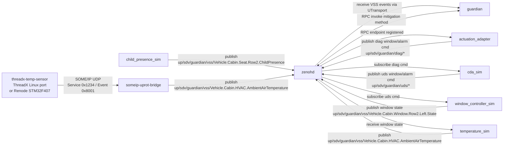
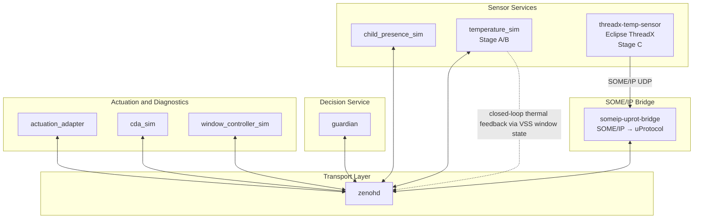

# Tutorial
# hack-to-the-future

Minimal Rust-based demo for a child-in-car guardian flow using uProtocol over Zenoh.

## What is in this repo

- `guardian`: central decision service.
- `child_presence_sim`: publishes child presence events.
- `temperature_sim`: software temperature simulator for the closed loop. It reacts to both window state and HVAC state.
- `actuation_adapter`: receives mitigation requests from `guardian`.
- `cda_sim`: simulated diagnostics layer.
- `window_controller_sim`: simulated window actuator.
- `someip_uprot_bridge`: converts SOME/IP temperature messages to uProtocol.
- `someip_window_bridge`: converts window-state uProtocol events back to SOME/IP.
- `ros2-hvac/`: ROS 2 HVAC simulator workload orchestrated by Eclipse Muto and observed through `ros2_medkit`.
- `threadx-temp-sensor/`: Eclipse ThreadX temperature sensor used for the ThreadX/SOME-IP path.

## Prerequisites

- Rust and Cargo
- Docker with Docker Compose

## Quick start

Check that the workspace builds:

```bash
cargo check --workspace
```

Start the default stack:

```bash
docker compose up --build
```

This starts:

- `zenohd`
- `guardian`
- `child-presence-sim`
- `temperature-sim`
- `actuation-adapter`
- `cda-sim`
- `window-controller-sim`

Exposed ports:

- `7447`: `zenohd`
- `8080`: `guardian`
- `8094`: `guardian-dashboard`
- `8092`: `window-controller-sim`

Start the default stack plus the ROS 2 HVAC workload:

```bash
docker compose --profile ros2 up --build
```

This adds:

- `ros2-hvac`
- `medkit-web-ui`

Notes:

- `ros2-hvac` exposes the `ros2_medkit` gateway on `18080` (container port `8080`) and the HVAC fault UI on `18081`.
- `medkit-web-ui` is available on `http://localhost:3000`.
- Inside the container, Eclipse Muto launches the HVAC workload from a `stack/archive` manifest. The ROS 2 package is served by the local `artifact-server` and provisioned into `/root/.muto/workspaces/guardian_hvac_simulator`.
- A Rust `up-rust` bridge exposes the VSS HVAC setpoint interface, publishes HVAC state into Zenoh, and mirrors that state into ROS 2 parameters.
- `temperature-sim` consumes the HVAC state and target temperature and cools the cabin faster through HVAC than through window opening alone.
- `ros2_medkit` is started with the diagnostics bridge enabled so HVAC faults appear through the REST API, and the bridge UI can inject an HVAC fault for guardian escalation tests.
- `guardian-dashboard` is available on `http://localhost:8094` and aggregates the live Guardian, HVAC, child presence, window, and medkit fault view in one page.
- `rqt`, `rqt_graph`, and the common `rqt` plugins are installed in the `ros2-hvac` image for ROS 2 topic and graph inspection.

### Verify the deployed HVAC workload

After the `ros2` profile is up, verify that Muto deployed the archive and that the HVAC node is running:

```bash
docker compose --profile ros2 exec ros2-hvac bash
source /opt/ros/$ROS_DISTRO/setup.bash
source /opt/muto_ws/install/setup.bash
ros2 node list
ros2 topic echo /diagnostics --once
```

Expected signals:

- `/hvac_simulator` appears in `ros2 node list`
- `/diagnostics` contains `guardian_hvac/thermal_state`
- `http://localhost:18081/api/state` returns the current HVAC bridge state
- `http://localhost:18080/api/v1/faults` shows HVAC faults after fault injection

To inspect the deployed Muto workspace directly:

```bash
cat /root/.muto/workspaces/guardian_hvac_simulator/run.log
ps -ef | grep -E 'run.sh|hvac_simulator|ros2 launch'
```

To observe ROS 2 topics with `rqt` from the running `ros2-hvac` container:

```bash
docker compose --profile ros2 exec ros2-hvac bash
source /opt/ros/$ROS_DISTRO/setup.bash
source /opt/muto_ws/install/setup.bash
rqt
```

Common views:

- `Plugins -> Introspection -> Node Graph`
- `Plugins -> Topics -> Topic Monitor`
- `Plugins -> Topics -> Message Publisher`

If you run this from a container, GUI display forwarding must already work on your host. If not, use the same ROS environment on the host or add an X/Wayland display bridge.

## Windows + WSL + Docker Compose

If you are using Windows with WSL and the ROS 2 stack is running inside the Docker Compose containers, the recommended workflow is:

1. Start the ROS 2 profile from your WSL shell:

```bash
docker compose --profile ros2 up --build
```

2. Keep ROS 2 running in the containers.

3. Start `rqt` from WSL against the running `ros2-hvac` container:

```bash
docker compose --profile ros2 exec ros2-hvac bash
source /opt/ros/$ROS_DISTRO/setup.bash
source /opt/muto_ws/install/setup.bash
rqt
```

Notes for Windows/WSL:

- This assumes WSLg is available, so Linux GUI apps can open directly on Windows.
- If you do not have WSLg, you need an X server on Windows and a working `DISPLAY` setup in WSL.
- `rqt` does not connect over ports `18080` or `18081`; it inspects ROS 2 topics from inside the ROS environment.
- `18080` remains the `ros2_medkit` REST API.
- `18081` remains the custom HVAC fault UI.

### Use the official `ros2_medkit_web_ui`

When the `ros2` profile is active, the official `ros2_medkit_web_ui` container is also available on:

```text
http://localhost:3000
```

Connect it to:

- Gateway URL: `http://localhost:18080`
- Base endpoint: `api/v1`

This UI is useful for browsing medkit entities, data, operations, and configurations. It complements the custom Guardian dashboard on `8094` rather than replacing it.

### Fault Injection and Observation

The verified ROS 2 HVAC flow on Thursday, August 27, 2026 is:

1. Open the HVAC fault UI:

```text
http://localhost:18081
```

2. Toggle the simulated HVAC fault.

3. Verify the bridge state:

```bash
curl http://localhost:18081/api/state
```

4. Verify the ROS 2 diagnostic:

```bash
docker compose --profile ros2 exec ros2-hvac bash
source /opt/ros/$ROS_DISTRO/setup.bash
source /opt/muto_ws/install/setup.bash
ros2 topic echo /diagnostics --once
```

5. Verify the medkit fault output:

```bash
curl http://localhost:18080/api/v1/faults
```

When the fault is enabled, `ros2_medkit` should report an HVAC fault similar to:

- `fault_code: GUARDIAN_HVAC_THERMAL_STATE`
- `description: HVAC fault simulated`
- `severity_label: ERROR`
- `reporting_sources: ["/diagnostic_bridge"]`

### Install `rqt` on WSL Ubuntu 24.04

If you want to run `rqt` directly from WSL Ubuntu 24.04 instead of from inside the container, use the current ROS 2 Jazzy packages.

1. Install ROS 2 Jazzy on Ubuntu 24.04 in WSL if it is not already installed.

2. Install `rqt` and common plugins:

```bash
sudo apt update
sudo apt install ros-jazzy-rqt\*
```

3. Source the ROS 2 environment in WSL:

```bash
source /opt/ros/jazzy/setup.bash
```

4. Start `rqt`:

```bash
rqt
```

Notes:

- On Ubuntu 24.04, ROS 2 Jazzy is the supported ROS 2 release.
- If the ROS 2 packages are not yet configured in WSL, follow the official ROS 2 Jazzy Ubuntu installation guide first.
- If `rqt` is started from WSL rather than from the container, it still needs network and DDS visibility to the ROS 2 graph running in Docker.

## ThreadX / SOME-IP path

The ThreadX-based temperature sensor and BOTH SOME/IP bridges are available through the `threadx` compose profile:

```bash
docker compose --profile threadx up --build
```

That adds:

- `threadx-temp-sensor`
- `someip-uprot-bridge`
- `someip-window-bridge`

Notes:

- `someip-uprot-bridge` exposes UDP `30501`.
- The embedded sensor sources live in [`threadx-temp-sensor/`]
- Do not run `temperature-sim` at the same time as the ThreadX/SOME-IP temperature path.

## Current Flow Diagram



## Current Architecture Diagram


